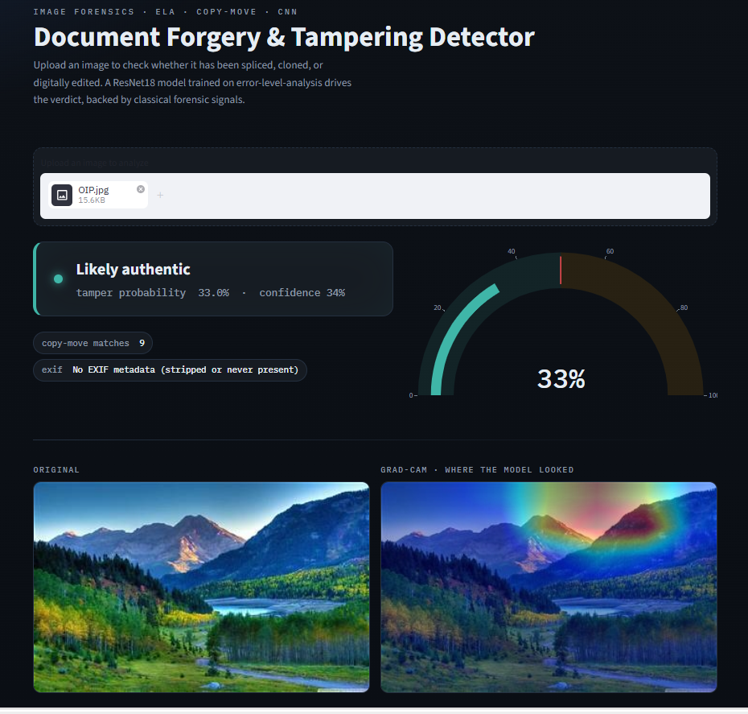
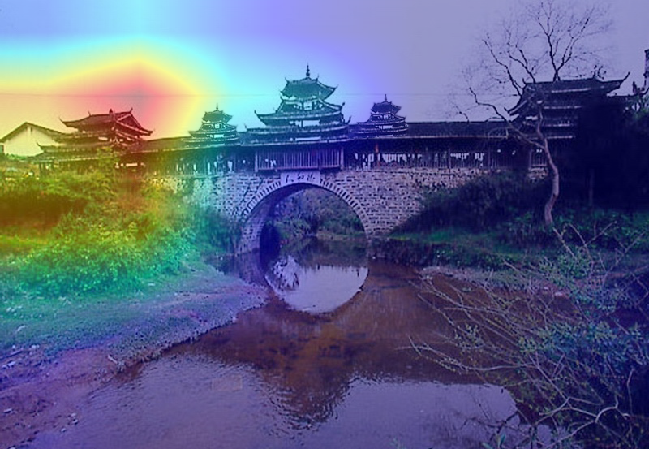

# Image Forgery & Tampering Detector

Detect whether an image has been spliced, cloned, or digitally edited — combining
classical image forensics with a deep-learning classifier, wrapped in a clean
Streamlit interface.

Most beginner computer-vision projects are cat-vs-dog classifiers. This one does
**image forensics**: it takes a suspicious image (a doctored receipt, an edited
certificate, a tampered ID) and returns a tamper probability, a heatmap showing
*where* the edit likely is, and supporting forensic evidence.

---

## 🎥 Demo

<!-- Option A: upload your screen recording to the repo (or a GitHub Release) and link it here -->
▶️ **[Watch the demo video](forgery-detection-demo.mp4)**

<!-- Option B: paste a YouTube link instead and GitHub will show a thumbnail
[](https://youtu.be/YOUR_VIDEO_ID)
-->

> Tip: to embed a playable clip directly in the README, drag-and-drop the `.mp4`
> into a GitHub issue or the README editor on github.com — GitHub uploads it and
> gives you a `user-images.githubusercontent.com` link that plays inline.

---

## 📸 Output examples

### Likely tampered


### Likely authentic


### Grad-CAM heatmap — where the model looked


---

## How it works

The tool runs four independent signals and reads them together:

| Signal | What it does |
|---|---|
| **Error Level Analysis (ELA)** | Re-saves the image at a known JPEG quality and diffs it against the original. Edited regions were compressed a different number of times, so they light up differently. |
| **Copy-move detection** | Uses ORB keypoint matching to find regions duplicated *within* the same image — the classic clone-stamp tell. |
| **EXIF / metadata check** | Flags missing metadata, editing-software tags (Photoshop, GIMP…), and timestamp mismatches. |
| **CNN classifier** | A ResNet18 fine-tuned on ELA images outputs a tamper probability. **Grad-CAM** then produces a heatmap of the regions that drove the decision. |

The CNN probability is the primary verdict; ELA, copy-move, and EXIF are supporting
evidence. On metadata-stripped images the classical signals can be quiet — that's
expected, so the signals are read together rather than in isolation.

---

## 📊 Model

- **Architecture:** ResNet18 (ImageNet-pretrained), final layer fine-tuned to 2 classes
- **Input:** Error-Level-Analysis image (224×224)
- **Dataset:** [CASIA v2](https://www.kaggle.com/datasets/divg07/casia-20-image-tampering-detection-dataset) — 7,491 authentic + 5,123 tampered images
- **Validation AUC:** ~0.97
- **Class imbalance** handled with weighted cross-entropy

---

## 🛠️ Tech stack

`PyTorch` · `torchvision` · `OpenCV` · `Pillow` · `scikit-image` ·
`Streamlit` · `Plotly` · `pandas` · `scikit-learn`

---

## Getting started

### 1. Clone and set up

```bash
git clone https://github.com/YOUR_USERNAME/image-forgery-detector.git
cd image-forgery-detector

python -m venv venv
# Windows
venv\Scripts\activate
# macOS / Linux
source venv/bin/activate

pip install -r requirements.txt
```

> **GPU (optional but faster):** the default install is CPU-only. For an NVIDIA GPU,
> install the CUDA build of PyTorch:
> ```bash
> pip install torch torchvision --index-url https://download.pytorch.org/whl/cu121
> ```

### 2. Get the dataset & train (skip if you have `best_model.pth`)

```bash
# download CASIA v2 into data/CASIA2/ (Au/ and Tp/ folders), then:
python build_manifest.py            # build labelled manifest
python phase3_precompute_ela.py     # cache ELA images
python phase3_train.py --epochs 8   # fine-tune ResNet18 -> best_model.pth
```

### 3. Run the app

```bash
streamlit run app.py
```

Then open `http://localhost:8501` and upload an image.

---

## ⚠️ Notes & limitations

- **Screenshots and re-saved images skew the score.** Re-compression changes the
  error-level signature, which can raise the tamper probability even for a genuine
  image. Analyze originals where possible.
- The model was trained on CASIA v2 and reflects that dataset's style; performance
  on very different image types may vary (normal domain shift).
- This is a decision-support tool, not legal proof of forgery.


---

## 🙋 Author

**Zainab Bibi** — AI / Machine Learning Engineer
[LinkedIn](https://www.linkedin.com/in/zainab-bibi-a177691b9/)
